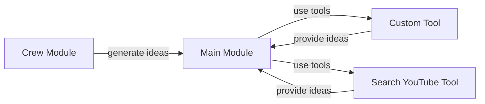

# Comprehensive Overview
The YouTube Idea Generator Crew is a Python-based project designed to generate ideas for YouTube videos. The project consists of several components, including a crew module, a main module, and various tools.

## Project Structure
The project is structured into the following directories:
- `src`: This directory contains the source code of the project.
- `src/youtube_idea_generator_crew`: This directory contains the main components of the project, including the crew module, main module, and tools.
- `src/youtube_idea_generator_crew/config`: This directory contains configuration files for agents and tasks.
- `src/youtube_idea_generator_crew/tools`: This directory contains various tools used by the project.

## Components
The project has the following components:
- `crew.py`: This file contains the crew module, which is responsible for generating ideas for YouTube videos.
- `main.py`: This file contains the main module, which is the entry point of the project.
- `custom_tool.py` and `SearchYouTubeTool.py`: These files contain custom tools used by the project.

## Mermaid Art Diagrams
The following mermaid art diagram shows the component relationships and flows:

This diagram shows the crew module generating ideas and passing them to the main module, which then uses the custom tool and Search YouTube tool to provide more ideas.

## Setup Instructions
To set up the project, follow these steps:
1. Clone the repository from GitHub.
2. Create a virtual environment and install the required dependencies.
3. Configure the agents and tasks in the `config` directory.
4. Run the `main.py` file to start the project.

## Code Examples
Here is an example of how to use the crew module:
```python
from youtube_idea_generator_crew import crew

# Generate ideas
ideas = crew.generate_ideas()

# Print the ideas
for idea in ideas:
    print(idea)
```
This code example shows how to use the `crew` module to generate ideas and print them.