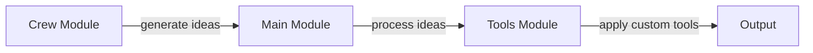

# Core Workflows and Data Flows
The YouTube Idea Generator Crew is a Python-based project designed to generate ideas for YouTube videos. This document explains the core workflows and data flows within the project, including the crew module's idea generation process, the main module's entry point, and the tools module's custom tools.

## Project Structure
The project consists of several components, including:
- `crew.py`: responsible for idea generation
- `main.py`: the entry point of the project
- `config`: contains configuration files for agents and tasks
- `tools`: includes custom tools such as `custom_tool.py` and `SearchYouTubeTool.py`

## Workflows
The project's workflows can be visualized using mermaid diagrams:

### Idea Generation Workflow
The idea generation workflow involves the following steps:
1. The `crew.py` module generates ideas based on user preferences stored in `knowledge/user_preference.txt`.
2. The generated ideas are then passed to the `main.py` module for processing.
3. The `main.py` module applies filtering and sorting to the ideas based on configuration files in `config/agents.yaml` and `config/tasks.yaml`.

### Custom Tool Usage Workflow
The custom tool usage workflow involves the following steps:
1. The `tools/custom_tool.py` module is used to apply custom processing to the generated ideas.
2. The `tools/SearchYouTubeTool.py` module is used to search for relevant YouTube videos based on the processed ideas.

## Setup Instructions
To set up the project, follow these steps:
1. Clone the repository to a local directory.
2. Install required packages using `pyproject.toml`.
3. Configure user preferences in `knowledge/user_preference.txt`.
4. Run the project using `main.py`.

## Code Examples
Example code from `crew.py`:
```python
def generate_ideas(user_preferences):
    # idea generation logic here
    return ideas
```
Example code from `main.py`:
```python
def process_ideas(ideas):
    # idea processing logic here
    return processed_ideas
```
Example code from `custom_tool.py`:
```python
def apply_custom_tool(ideas):
    # custom tool logic here
    return processed_ideas
```