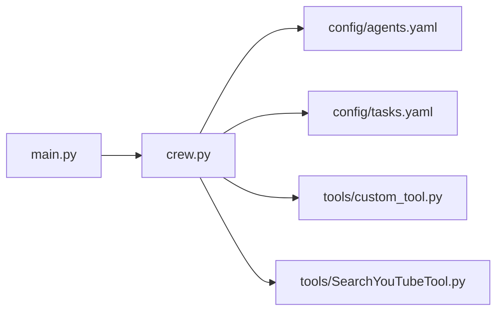

# Getting Started Guide
The YouTube Idea Generator Crew is a Python-based project designed to generate ideas for YouTube videos. This guide provides a step-by-step introduction to get started with the project.

## Project Structure
The project consists of several components, including:
- `crew.py`: The crew module, responsible for generating ideas.
- `main.py`: The main module, responsible for executing the project.
- `config/`: Directory containing configuration files, including `agents.yaml` and `tasks.yaml`.
- `tools/`: Directory containing tool files, including `custom_tool.py` and `SearchYouTubeTool.py`.

## Setup Instructions
To set up the project, follow these steps:
1. Clone the repository to your local machine.
2. Navigate to the project directory.
3. Install required dependencies using `pyproject.toml`.

## Basic Usage
To use the project, follow these steps:
1. Execute the `main.py` file.
2. Follow the prompts to generate ideas.

## Component Relationships
The components of the project are related as follows:

This diagram shows the relationships between the main module, crew module, configuration files, and tool files.

## Example Usage
Here is an example of how to use the project:
```python
# main.py
from youtube_idea_generator_crew import crew

# Generate ideas
ideas = crew.generate_ideas()

# Print ideas
for idea in ideas:
    print(idea)
```
This example shows how to generate ideas using the `crew` module.

## Configuration
The project uses configuration files to store settings and preferences. The `agents.yaml` file contains settings for the crew module, while the `tasks.yaml` file contains settings for the tasks.

## Tools
The project includes several tools, including `custom_tool.py` and `SearchYouTubeTool.py`. These tools can be used to customize the project and extend its functionality.