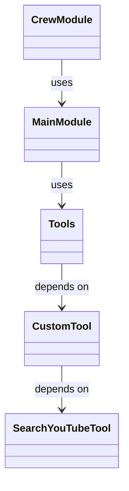

# System Architecture and Key Design Decisions
The YouTube Idea Generator Crew is a Python-based project designed to generate ideas for YouTube videos. The project consists of several components, including a crew module, a main module, and various tools.

## Modular Architecture
The project uses a modular architecture, with each module having its own specific responsibility. The `crew.py` module, for example, is responsible for managing the crew members and their tasks. The `main.py` module is the entry point of the application and is responsible for orchestrating the different components.

```python
# src/youtube_idea_generator_crew/crew.py
class CrewMember:
    def __init__(self, name, role):
        self.name = name
        self.role = role

# src/youtube_idea_generator_crew/main.py
from youtube_idea_generator_crew.crew import CrewMember

def main():
    crew_member = CrewMember("John Doe", "Developer")
    # ...
```

## Dependency Injection
The project uses dependency injection to manage the dependencies between the different components. For example, the `SearchYouTubeTool.py` module depends on the `custom_tool.py` module.

```python
# src/youtube_idea_generator_crew/tools/SearchYouTubeTool.py
from youtube_idea_generator_crew.tools.custom_tool import CustomTool

class SearchYouTubeTool:
    def __init__(self, custom_tool: CustomTool):
        self.custom_tool = custom_tool

# src/youtube_idea_generator_crew/tools/custom_tool.py
class CustomTool:
    def __init__(self):
        # ...
```

## mermaid Art Diagrams
The following mermaid art diagram shows the relationships between the different components:


## Setup Instructions
To set up the project, follow these steps:

1. Clone the repository: `git clone https://github.com/user/youtube-idea-generator-crew.git`
2. Install the dependencies: `pip install -r requirements.txt`
3. Run the application: `python src/youtube_idea_generator_crew/main.py`